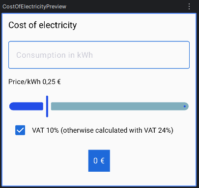
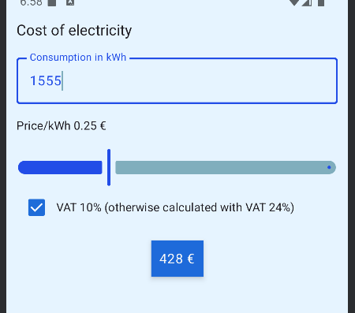
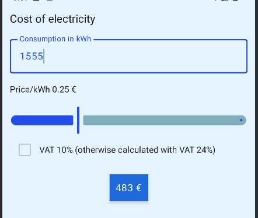

## Cost of electricity calculator

Simple UI and calculator for electricity cost based on consumption, price per kWh (initial value set to 0,05 €) and VAT % . 

### Screenshots






### Features 

This project implements UI and logic for calculations based on your input and slider value.
  
- Input field to enter consumption amount in kWh
- Slider to adjust price/kWh (range from -0,05 - 1,00 €) -> allows negative price
- Calculation result displays automatically, rounded up to the nearest euro
- By default calculation is done with VAT 10%, VAT 24% can be selected by unchecking the option


### Implementation details

- `Column` layout to arrange elements vertically on top of each other
- `OutlinedTextField` component with `numeric keyboard type`
- `Checkbox` component for alternative VAT option
- `Row` component to align checkbox and its label text
- `Surface` component for result display
- Styling uses `modifiers` (padding, width, colors, borders)

### Running the app

This project was created using Android Studio. To clone and open the project:
   ```bash
- git clone https://github.com/Anniina-55/cost-of-eletricity.git
- cd cost-of-eletricity
- open and run the project in Android Studio

-> UI should render on emulator and connected physical devices

